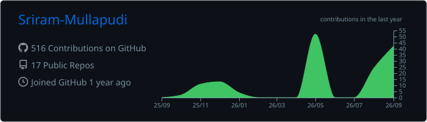
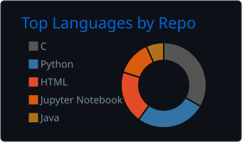
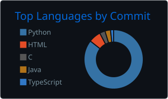
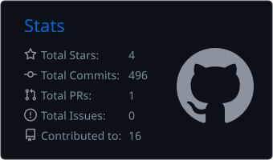
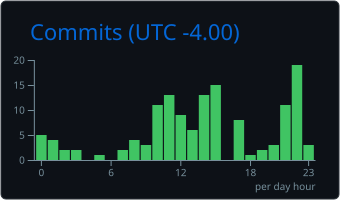

<!--
  GitHub Profile README for Sriram Mullapudi
  Profile repository must be public and named exactly: Sriram-Mullapudi
  Verified profile username used throughout: Sriram-Mullapudi

  Before publishing:
  1. Replace YOUR_LEETCODE_USERNAME after confirming your exact LeetCode handle.
  2. Replace YOUR_CREDLY_CREDENTIAL_URL with the public AWS credential URL.
  3. Enable the contribution-snake workflow described after this README.
-->

<!-- ============================== HERO ============================== -->


<div align="center">

<a href="https://readme-typing-svg.demolab.com">
  

<br/>

<a href="mailto:srirammullapudi20@gmail.com">
  
</a>
<a href="https://linkedin.com/in/srirammullapudi">
  
</a>
<a href="https://github.com/Sriram-Mullapudi">
  
</a>

<!-- Replace YOUR_LEETCODE_USERNAME, then uncomment this badge.
<a href="https://leetcode.com/u/YOUR_LEETCODE_USERNAME/">
  
</a>
-->

<!-- Replace YOUR_CREDLY_CREDENTIAL_URL, then uncomment this badge.
<a href="YOUR_CREDLY_CREDENTIAL_URL">
  
</a>
-->

<br/><br/>


</div>

<!-- =========================== INTRODUCTION ========================== -->

## Engineering reliable systems at scale

I am a **full-stack software engineer with 4+ years of experience** building **Java and Spring Boot services** and **React applications** for high-volume **payment and identity systems**.

My work includes Kafka workflows processing **500K+ events per day** on a platform handling **10M+ annual transactions**, a **30% reduction in end-to-end latency**, and React/TypeScript dashboards[...]

<table>
<tr>
<td width="25%" align="center"><strong>10M+</strong><br/><sub>annual transactions</sub></td>
<td width="25%" align="center"><strong>500K+</strong><br/><sub>daily Kafka events</sub></td>
<td width="25%" align="center"><strong>30%</strong><br/><sub>latency reduction</sub></td>
<td width="25%" align="center"><strong>150+</strong><br/><sub>daily dashboard users</sub></td>
</tr>
</table>

<!-- ============================== ABOUT ============================== -->

## About me

```yaml
role: Full-Stack Software Engineer
experience: 4+ years
core_stack:
  - Java 17
  - Spring Boot
  - React
  - TypeScript
  - Kafka
  - AWS
engineering_focus:
  - Distributed payment systems
  - Event-driven workflows
  - Identity and access management
  - Full-stack operational tooling
education: M.S. in Computer Science, University of South Florida
gpa: 3.96 / 4.00
mobility: Open to relocation
```

### Current focus

* Designing **Java 17 and Spring Boot** services for validation, routing, status tracking, and multi-tenant systems.
* Building **React, TypeScript, and Redux Toolkit** interfaces that turn operational data into usable workflows.
* Developing **event-driven systems** with idempotent processing, recovery paths, and downstream failure isolation.
* Applying **AWS, Docker, Terraform, GitHub Actions, and Jenkins** to deployment and delivery workflows.

<!-- =========================== TECHNOLOGY ============================ -->

## Technology stack

<div align="center">

### Languages


### Frontend


### Backend & data


### Cloud, delivery & tooling


</div>

<details>
<summary><strong>Complete skills matrix</strong></summary>
<br/>

| Area                | Skills                                                                                                                   |
| ------------------- | ------------------------------------------------------------------------------------------------------------------------ |
| **Languages**       | Java, TypeScript, JavaScript, SQL, Rust, Python, C                                                                       |
| **Frontend**        | React, Next.js, Redux Toolkit, Tailwind CSS, MUI, HTML, CSS                                                              |
| **Backend**         | Spring Boot, Spring Security, Spring Data JPA, Hibernate, Node.js, Express.js, REST APIs, GraphQL, Kafka, OAuth 2.0, JWT |
| **Data**            | PostgreSQL, Oracle, MySQL, Redis, SQLite, pgvector                                                                       |
| **Cloud & DevOps**  | AWS ECS Fargate, EC2, RDS, S3, IAM, CloudWatch, Docker, Terraform, GitHub Actions, Jenkins, CI/CD                        |
| **Testing & Tools** | JUnit 5, Mockito, Cypress, Jest, SonarQube, Git, Linux                                                                   |
| **Architecture**    | Microservices, event-driven systems, API design, idempotent processing, multi-tenant systems, RAG                        |

</details>

<!-- ============================ EXPERIENCE =========================== -->

## Experience highlights

### JPMorgan Chase & Co. — Software Engineer, Full Stack

<sub>Payments Platform · Tampa, Florida · March 2025 – May 2026</sub>

* Developed Java 17 and Spring Boot services for payment validation, routing, and status tracking across a distributed platform handling **10M+ transactions annually**.
* Migrated synchronous validation flows to Kafka workflows processing **500K+ events daily**, reducing end-to-end latency by **30%**.
* Built React, TypeScript, and Redux Toolkit investigation dashboards used daily by **150+ operations analysts**.
* Increased automated test coverage from **65% to 85%+** and enforced SonarQube quality gates in Jenkins and GitHub Actions pipelines.
* Designed Oracle and PostgreSQL schemas and data-access layers for payment workflows.

### Accenture — Associate Software Engineer

<sub>Chennai, India · October 2021 – July 2024</sub>

* Implemented Okta-based OAuth 2.0/JWT authentication and Spring Security RBAC for applications serving **25K+ users**.
* Automated user provisioning, role assignment, and access management through Microsoft Graph and Google Workspace APIs.
* Helped migrate backend services to AWS, contributing to a **15% reduction in production incidents**.
* Tuned MySQL and PostgreSQL queries, reducing high-volume REST endpoint response times by **20%**.
* Increased backend test coverage to **80%+** and mentored **three junior engineers**.

<!-- ============================= PROJECTS ============================ -->

## Selected projects

<table>
<tr>
<td width="50%" valign="top">

### Multi-Tenant Knowledge Search Platform

A hybrid retrieval system combining **pgvector HNSW search**, PostgreSQL full-text search, and **Reciprocal Rank Fusion**.

**Highlights**

* Citation-backed answers streamed over Server-Sent Events
* Keyword-search fallback when the LLM service is unavailable
* JWT and refresh-token authentication with RBAC
* Owner-scoped queries, execution tracing, and append-only audit records
* ECS Fargate, RDS, ElastiCache, ALB, Secrets Manager, Terraform, and GitHub Actions with OIDC

`Java 17` `Spring Boot` `React` `PostgreSQL` `pgvector` `Redis` `AWS` `Docker` `Terraform`

<!-- Add the repository URL only after confirming the exact public repository:
[View project →](https://github.com/Sriram-Mullapudi/REPOSITORY_NAME)
-->

</td>
<td width="50%" valign="top">

### Offline-First Point-of-Sale System

An installable Windows point-of-sale application supporting offline sales, refunds, inventory, promotions, loyalty, and shift reconciliation.

**Highlights**

* Business and authorization rules centralized in the Rust backend
* Atomic SQLite operations for transaction integrity
* RBAC and Argon2 PIN hashing
* Append-only audit logs
* Duplicate-payment controls

`Rust` `Tauri 2` `SQLite` `React` `TypeScript`

<!-- Add the repository URL only after confirming the exact public repository:
[View project →](https://github.com/Sriram-Mullapudi/REPOSITORY_NAME)
-->

</td>
</tr>
</table>

<!-- ============================== STATS ============================== -->

## GitHub analytics

<div align="center">



<br/>




<br/>




<br/>


</div>


profile-summary-card-output/
└── github_dark/
    ├── 0-profile-details.svg
    ├── 1-repos-per-language.svg
    ├── 2-most-commit-language.svg
    ├── 3-stats.svg
    └── 4-productive-time.svg

Check the Code tab of your profile repository. If profile-summary-card-output is not present, the new analytics workflow has not generated or committed the files yet.

Also delete every remaining URL containing either of these domains from README.md:

github-readme-stats.vercel.app
streak-stats.demolab.com


<!-- =========================== ACHIEVEMENTS ========================== -->

## Achievements & certification

<div align="center">


</div>

* **AWS Certified Cloud Practitioner** — Amazon Web Services; credential verifiable on Credly.
* **Outstanding Performer at Accenture** — recognized for team-level initiatives and deliverables.
* **LeetCode** — **1,436 problems solved** across data structures and algorithms; **global rank 8,791**.

<!-- ============================ EDUCATION ============================ -->

## Education

### University of South Florida

**Master of Science in Computer Science** · **GPA: 3.96 / 4.00**

<!-- ============================== SNAKE ============================== -->

## Contribution journey

<!--
  Enable the workflow described after this README, confirm that the `output`
  branch exists, and then remove the opening/closing comment markers around
  the <picture> block below.

<picture>
  <source media="(prefers-color-scheme: dark)" srcset="https://raw.githubusercontent.com/Sriram-Mullapudi/Sriram-Mullapudi/output/github-snake-dark.svg" />
  <source media="(prefers-color-scheme: light)" srcset="https://raw.githubusercontent.com/Sriram-Mullapudi/Sriram-Mullapudi/output/github-snake.svg" />
  
</picture>
-->

<div align="center">
<sub>The animated contribution snake will appear here after the included workflow is enabled.</sub>
</div>

<!-- ============================== CTA ================================ -->

## Let’s connect

<div align="center">

I build full-stack software with **Java, Spring Boot, React, Kafka, and AWS**—with an emphasis on reliability, performance, and usable operational workflows.

<br/>

<a href="mailto:srirammullapudi20@gmail.com">
  
</a>
<a href="https://linkedin.com/in/srirammullapudi">
  
</a>

<br/><br/>

**Open to relocation**

</div>

<!-- ============================= FOOTER ============================== -->


