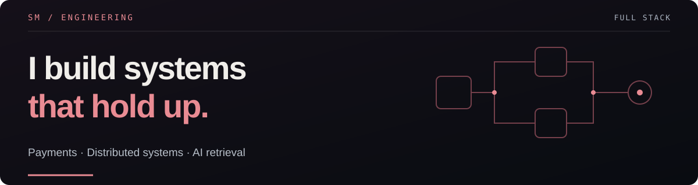
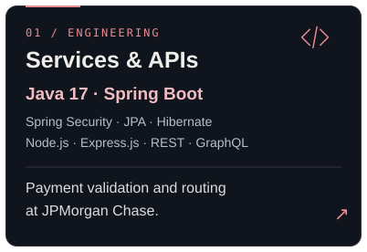
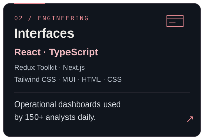
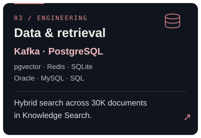
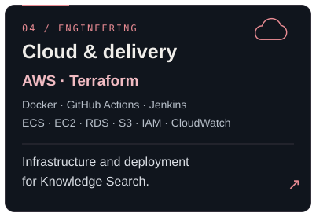
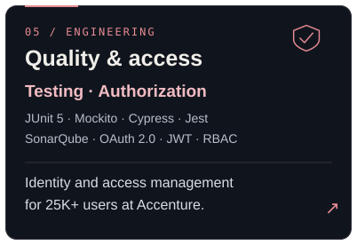
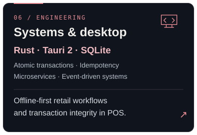
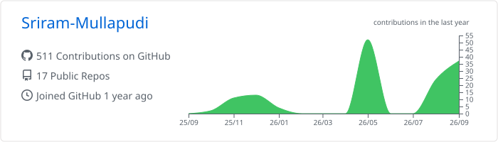

# Sriram Mullapudi

**Full-Stack Software Engineer · Java / Spring Boot / React / Kafka / AWS**

I build payment services, operational interfaces, and data systems with a focus on reliability and performance. My 4+ years of experience span distributed payments at JPMorgan Chase and identity and access management at Accenture.

[**Explore my portfolio ↗**](https://sriram-mullapudi.github.io/portfolio/) · [LinkedIn](https://www.linkedin.com/in/srirammullapudi/) · [Email](mailto:srirammullapudi20@gmail.com)

Open to full-stack and backend opportunities in the U.S. · Open to relocation

## Engineering in practice

At JPMorgan Chase, my work included:

- **500K+ daily Kafka events** on a platform handling **10M+ annual transactions**.
- **30% lower end-to-end latency** after migrating synchronous validation flows to Kafka workflows.
- **150+ operations analysts** using React and TypeScript investigation dashboards daily.

## A trail of small commits

<picture>
  <source media="(prefers-color-scheme: dark)" srcset="https://raw.githubusercontent.com/Sriram-Mullapudi/Sriram-Mullapudi/output/github-contribution-grid-snake-dark.svg" />
  
</picture>

My contribution calendar, with a little personality. Updated every 12 hours.

## Selected work

### 01 / Speedway POS

An offline-first Windows point-of-sale application for sales, refunds, inventory, promotions, loyalty, and shift reconciliation.

- **Built for transaction integrity:** atomic SQLite operations, duplicate-payment controls, and append-only audit logs.
- **Backend-enforced rules:** pricing, promotions, loyalty, RBAC, and Argon2 PIN hashing in Rust.
- **Validated separately:** 5K+ real-world sales; 10K+ integrity-test attempts across 20+ failure/concurrency scenarios, with zero duplicate charges in those tests.

`Rust` `Tauri 2` `SQLite` `React` `TypeScript`

[**Browse the code ↗**](https://github.com/Sriram-Mullapudi/speedway-pos) · [Read the case study](https://sriram-mullapudi.github.io/portfolio/#speedway-pos)

### 02 / Multi-Tenant Knowledge Search

A hybrid retrieval system combining pgvector HNSW and PostgreSQL full-text search with Reciprocal Rank Fusion.

- **Retrieval at scale:** 30K documents; ~1 s p95 retrieval latency.
- **Measured answer quality:** 92% Recall@10 and an 83% acceptable-answer rate on ~200 labelled queries.
- **Tenant-aware delivery:** isolation at API and data-access layers, citation-backed answers over SSE, and keyword fallback when the LLM service is unavailable.

`Java 17` `Spring Boot` `React` `PostgreSQL` `pgvector` `Redis` `AWS` `Terraform`

[**Read the architecture and evaluation ↗**](https://sriram-mullapudi.github.io/portfolio/#knowledge-search)

### More to explore

- [**Cargo Booker Pro**](https://github.com/Sriram-Mullapudi/Cargo-Booker-Pro) — Django logistics application for shipment booking, tracking, and invoices.
- [**Xv6 systems work**](https://github.com/Sriram-Mullapudi/OS_Project-2-Syscalls-and-Schedulers) — custom system calls, scheduling, and command-line utilities.
- [**Portfolio source**](https://github.com/Sriram-Mullapudi/portfolio) — engineering case studies, interactive architecture walkthroughs, and photography.

## Engineering toolkit

**Core stack:** `Java` · `Spring Boot` · `React` · `TypeScript` · `Kafka` · `AWS`

Six areas of practice. Select a panel to explore the related work.

<strong>Explore the complete technical skill set</strong>

### Languages

`Java` `TypeScript` `JavaScript` `SQL` `Rust` `Python` `C`

### Interfaces & applications

`React` `Next.js` `Redux Toolkit` `Tailwind CSS` `MUI` `HTML` `CSS` `Tauri 2`

### Services & APIs

`Spring Boot` `Spring Security` `Spring Data JPA` `Hibernate` `Node.js` `Express.js` `REST APIs` `GraphQL`

### Data & messaging

`PostgreSQL` `Oracle` `MySQL` `Redis` `SQLite` `pgvector` `Kafka`

### Cloud & delivery

`AWS ECS Fargate` `EC2` `RDS` `S3` `IAM` `CloudWatch` `Docker` `Terraform` `GitHub Actions` `Jenkins` `CI/CD`

### Testing, security & tooling

`JUnit 5` `Mockito` `Cypress` `Jest` `SonarQube` `OAuth 2.0` `JWT` `RBAC` `Argon2` `Git` `Linux`

### Systems & architecture

`Microservices` `Event-driven systems` `API design` `Idempotent processing` `Multi-tenant systems` `RAG` `Hybrid retrieval`

## Experience

**JPMorgan Chase & Co. — Software Engineer, Full Stack** 
Payments Platform · Tampa, Florida · March 2025 – May 2026

Java and Spring Boot payment services, Kafka workflows, React operational dashboards, and automated quality gates.

**Accenture — Associate Software Engineer** 
Chennai, India · October 2021 – July 2024

Identity and access management for applications serving 25K+ users, AWS migration, and REST endpoint performance improvements.

<strong>More about my contributions</strong>

### JPMorgan Chase & Co.

- Developed Java 17 and Spring Boot services for payment validation, routing, and status tracking across a distributed platform handling 10M+ transactions annually.
- Migrated synchronous validation flows to Kafka workflows processing 500K+ events daily, reducing end-to-end latency by 30%.
- Built React, TypeScript, and Redux Toolkit investigation dashboards used daily by 150+ operations analysts.
- Increased automated test coverage from 65% to 85%+ and enforced SonarQube quality gates in Jenkins and GitHub Actions pipelines.
- Designed Oracle and PostgreSQL schemas and data-access layers for payment workflows.

### Accenture

- Implemented Okta-based OAuth 2.0/JWT authentication and Spring Security RBAC for applications serving 25K+ users.
- Automated user provisioning, role assignment, and access management through Microsoft Graph and Google Workspace APIs.
- Containerized and migrated backend services to AWS, contributing to a 15% reduction in production incidents.
- Tuned MySQL and PostgreSQL queries, reducing high-volume REST endpoint response times by 20%.
- Increased backend test coverage to 80%+ and mentored three junior engineers.

## Education & recognition

**M.S. in Computer Science · University of South Florida** — GPA: 3.96 / 4.00

AWS Certified Cloud Practitioner · Outstanding Performer at Accenture

<strong>GitHub activity</strong>

<picture>
  <source media="(prefers-color-scheme: dark)" srcset="profile-summary-card-output/github_dark/0-profile-details.svg" />
  
</picture>

---

<strong>Always exploring. Always building.</strong>

**Good systems. Good people.** 
Interested in working together? [Get in touch](mailto:srirammullapudi20@gmail.com) or [explore my portfolio](https://sriram-mullapudi.github.io/portfolio/).
